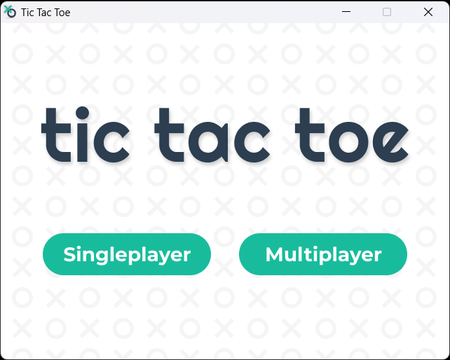
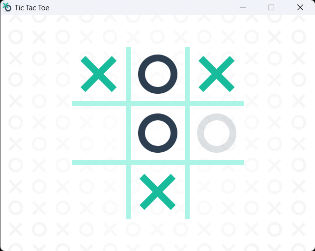
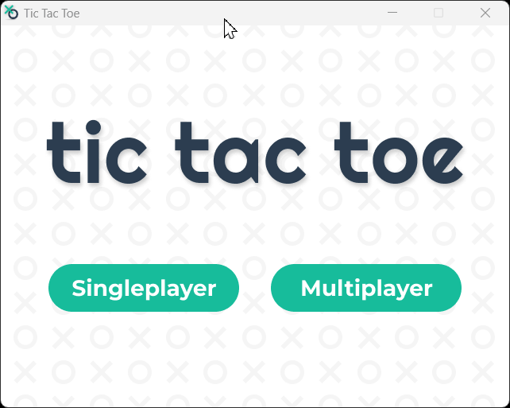

# Tic Tac Toe

> Play Tic Tac Toe against a friend or an unbeatable computer AI

| Technologies |
| --- |
| C |
| [SDL2](https://www.libsdl.org/) |
| [Make](https://www.gnu.org/software/make/manual/make.html) Buildsystem |

* Computer AI uses the minimax algorithm.

## Screenshots
<p align="center">
    
    
    
    
</p>

## Setup Instructions
1. Clone repo
2. Run executable

```bash
$ ./build/main.exe
```
